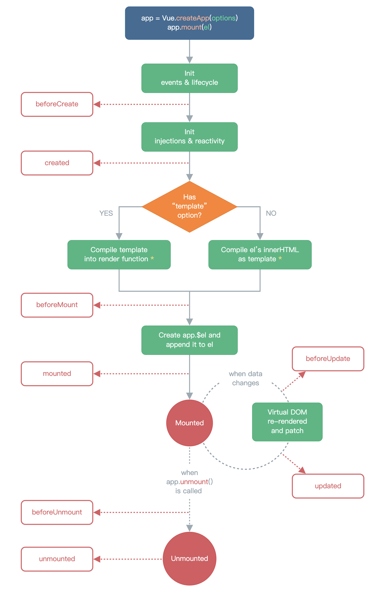

# 生命周期

+ **beforeCreate：** 在实例初始化之后、进行数据侦听和事件/侦听器的配置之前同步调用
+ **created：** 在实例创建后被立即同步调用。此时数据侦听、计算属性、方法、事件/侦听器的回调函数已经配置完毕
+ **beforeMount：** 在挂载之前被调用，相关的render函数首次被调用。**该钩子在服务器端渲染期间不被调用** 
+ **mounted：** 在实例挂载后被调用。mounted不会保证所有子组件也都被挂载完成，如果希望等待整个视图都渲染完毕，可以在mounted内部使用$nextTick。**该钩子在服务器端渲染期间不被调用** 
+ **beforeUpdate：** 在数据发生改变后，DOM被更新之前被调用。这里适合在现有DOM将要被更新之前访问它，比如移除手动添加的事件监听器。**该钩子在服务器端渲染期间不被调用，只有初次渲染会在服务端进行。** 
+ **updated：** 在数据更改导致的虚拟DOM重新渲染和更新完毕之后被调用。在此期间要相应状态改变，通常最好使用计算属性或侦听器取而代之。updated也不会保证所有的子组件都被渲染完毕
+ **activated：** 被keep-alive缓存的组件激活时调用。**该钩子在服务器端渲染期间不被调用** 
+ **deactivated：** 被keep-alive缓存的组件失活时调用。**该钩子在服务器端渲染期间不被调用** 
+ **beforeUnmount：** 在卸载组件实例之前调用，在这个阶段实例仍然是完全正常的。**该钩子在服务器端渲染期间不被调用** 
+ **unmounted：** 卸载组件实例后调用。调用此钩子时组件实例的所有指令都被解除绑定，所有事件侦听器都被移除，所有子组件实例被卸载。**该钩子在服务器端渲染期间不被调用** 
+ **errorCaptured：** 在捕获一个来自后代组件的错误时被调用。
+ **renderTracked：** 跟踪虚拟DOM重新渲染时调用。
+ **renderTriggered：** 当虚拟DOM重新渲染被触发时调用

