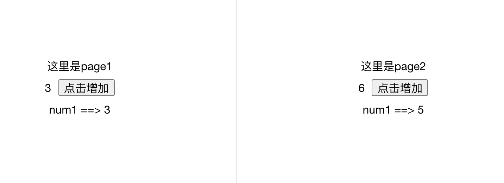

# 混入

一个混入对象可以包含任意组件选项，当组件使用混入对象时所有混入对象的选项将被混合进入该组件本身的选项。

每个mixin可以拥有自己的data函数，每个data函数都会被调用，并将返回结果合并。在数据的property发生冲突时会以自身的数据为优先

#### 基本用法

```javascript
// mixins/common.js
export default {
  data() {
    return {
      num:0,
      num1:10,
    }
  },
  methods: {
    addNum() {
      this.num ++
    }
  },
}
```

##### Page1

```vue
<template>
  <div class="page_wrapper">
    <div>这里是page1</div>
    <div>{{num}}<button @click="addNum">点击增加</button></div>
    <div>num1 ==> {{num1}}</div>
  </div>
</template>
<script>
import commonMixins from '@/mixins/common'
export default {
  mixins: [commonMixins],
  data() {
    return {
      num1:3,
    }
  },
  methods:{
    
  }
}
</script>
```

##### page2

``` vue
<template>
  <div class="page_wrapper">
    <div>这里是page2</div>
    <div>{{num}}<button @click="addNum">点击增加</button></div>
    <div>num1 ==> {{num1}}</div>
  </div>
</template>
<script>
import commonMixins from '@/mixins/common'
export default {
  mixins: [commonMixins],
  data() {
    return {
      num1:5,
    }
  },
  methods: {
    addNum() {
      this.num += 2
    }
  }
}
</script>
```



